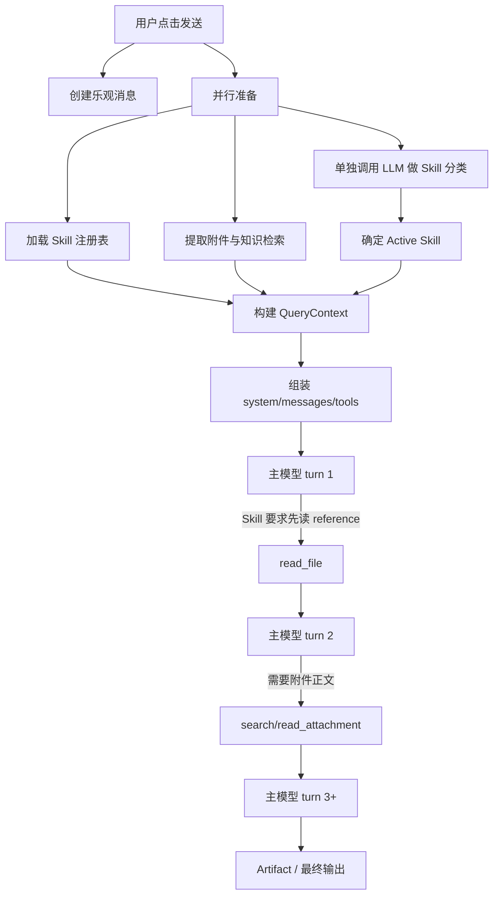
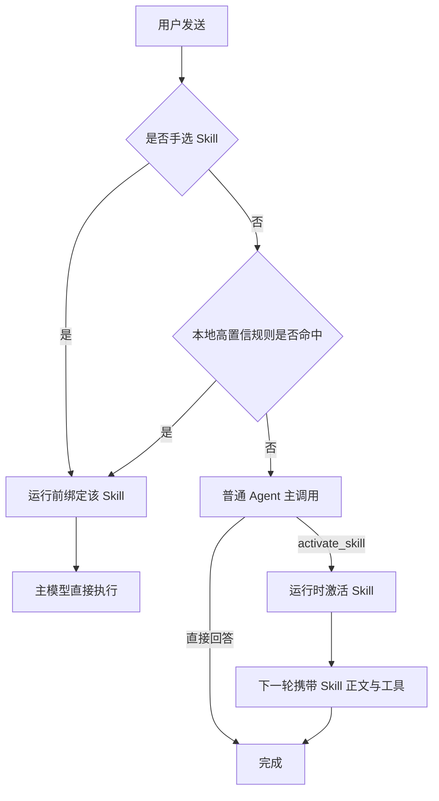

# Solidify Skill / Agent 请求链路改进建议

> 状态：实施中（截至 2026-08-22；已落地项见文末“实现进度”）
> 日期：2026-08-21（方案）/ 2026-08-22（实现进度）
> 范围：普通 Skill、附件读取、Agent 请求组装、工具暴露、Prompt Cache、运行可观测性，以及与 PPTD 共用的基础链路
> 不在本文件范围：直接修改代码、替换模型供应商、放弃 Solidify-refs 核心知识资产

## 1. 执行摘要

当前问题不是单纯的“模型慢”或“附件太大”，而是一次用户请求被扩展成了多次串行模型调用，并在这些调用之间重复发送上下文：

1. 未手选 Skill 时，客户端先调用一次用户当前模型做 Skill 分类；
2. 分类完成后，主请求仍然注入全部 Skill 索引、Active Skill、资源清单、通用 Artifact/PPTD 协议和工具 Schema；
3. 9/10 个内置 Skill 又强制模型“第一步读取”一个或多个 reference，保证主模型第一轮不会直接交付；
4. 附件即使很小也只注入有限预览，模型通常还要继续搜索和读取；
5. system prompt 含每次变化的毫秒时间戳，固定上下文难以复用 Prompt Cache；
6. 无工作区时仍可能提示模型写入 `03-交付物/`，形成“提示声明的能力”和“实际工具能力”不一致；
7. 旧 inline Skill、目录式 Skill、localStorage Skill、动态 legacy-guidance 和兼容别名仍然并存，形成两套事实来源。

用户实测中已经出现：PPT 运行 300–400 秒、约 40K token；架构图超过 60 秒。

关于 TTFT，两次带 Skill 的真实运行给出了一个**反直觉但方向明确**的结果（完整推导与取数方法见 §2.5）：

| | 需求分析 | Draw.io 架构图 | 早期裸聊天 |
|---|---:|---:|---:|
| 附件 | 8.4 KB | **77.6 KB（9.2×）** | 无 |
| 首 Token | **18s** | **12s** | 约 0.9s |
| 工具调用 | 5 | 16 | 0 |
| 总时长 | 83s | 217s | — |

**附件大 9 倍，首 Token 反而低 33%。** 这不是噪声，是代码决定的必然：`attachments/types.ts:30-32,102-125` 把单附件预览硬限在 480 字符、manifest 总计 6,000 字符，因此 77.6KB 文件进入首轮的部分不超过 480 字符；而 `ttftMs` 因 `run-state.ts:128` 的 `!state.firstTokenAt` 守卫**只记第一轮**。

> **首轮 TTFT 在构造上就不可能是附件体积的函数。** 任何“TTFT 随输入体积放大”的推论都不成立，不得作为 P0-2/P0-5 的立项依据。

由此确证三件事：

1. **工具执行不是瓶颈**：两次运行的工具墙钟合计约 0.2s 与 1.8s，占总时长 **< 1%**。代价不在工具本身，而在它触发的那次额外模型往返。
2. **瓶颈在首轮之后**：TTFT 只占总时长的 22% 与 5.5%，其余 78% / 94.5% 发生在第一个 token 之后。
3. **现有 `t/s` 指标不能作为证据**：`run-state.ts:65-72` 的分母横跨全部后续轮次，把第 2..N 轮的调用前延迟计入了“解码时间”。71.2 与 49.5 t/s 的差异主要反映轮次多少，不是解码快慢。本文件早期引用的 33.8 / 87.2 t/s 对比作废。

**尚未直接测量**、但与数据自洽的主假设：存在一个**与输入体积无关的每次调用固定延迟**（反解量级约 5–18s），总时长 ≈ 调用次数 × 固定延迟 + 真实解码。注意量级本身是反解推断，轮次数与真实解码速率均未直接测量，不得当作已测事实引用。该延迟有两个互斥成因，修复手段完全不同：

- **A. 网关缓冲思考**：推理模型的 thinking 未被流式送达，整段思考时间落进 TTFT。→ 砍往返与缓存均无效，需调整模型或思考预算。
- **B. 真实的每次调用固定开销**（排队、冷启动、中继跳数、客户端组装）。→ 砍往返按调用次数成倍收益。

**判定已完成：成因为 B。** 依据是账本中一个纯工具轮的 `reasoningLength = 0` 且 `outputTokens` 恰好被 tool call 样板占满，没有容纳隐藏思考的余量（推导见 §2.5）。

因此优先级为：**减少模型往返次数（P0-1、P0-4、P1-2）按调用次数成倍收益，是最高优先级且无前置依赖**。P0-2（Prompt Cache）的**成本**收益依然真实，但其**延迟**收益目前无证据支撑，不得据此提升为主线。

本建议的核心方向是：

- 将“前置隐藏分类”改成“同一 Agent 运行内激活”，手选 Skill 则完全跳过发现；
- 让 system prompt 保持稳定，把动态信息放到可变后缀或运行账本；
- 已选 Skill 不再携带全量 Skill 索引；
- reference 从“强制第一步读取”改为“满足明确条件才读取”；
- 根据附件大小和任务完整性要求决定全文直送或索引检索，避免一律先预览再工具读取；
- 只暴露当前阶段真正可调用的工具和输出契约；
- 迁移后删除旧 Skill 运行时和过时上游操作说明，保留 Solidify-refs 的核心知识。

建议将该专项命名为 **M4-R：Skill Runtime Performance & Reliability**，先修普通 Skill 的公共链路，再让 PPTD 使用同一套稳定前缀、附件策略和观测指标。

## 2. 现状与证据

### 2.1 当前请求流程



代码证据：

| 现象 | 位置 | 说明 |
|---|---|---|
| 自动路由在主运行前执行 | `src/hooks/use-chat.ts:408-433` | 未手选 Skill 时单独调用路由模型 |
| 路由使用当前主模型 | `src/lib/skills/auto-route.ts:157-189` | 不是本地规则或轻量专用分类器 |
| 路由最长等待 8 秒 | `src/lib/skills/auto-route.ts:26-31` | 24 输出 token，但仍有完整网络与 TTFT |
| 主请求再次注入全部 Skill 索引 | `src/lib/harness/builtin-hooks.ts:43-59` | 已经路由后仍重复提供发现信息 |
| Active Skill 再注入正文和资源清单 | `src/lib/engine/messages.ts:134-178` | 与索引同时存在 |
| system prompt 注入动态时间 | `src/lib/harness/builtin-hooks.ts:43` | 每次请求的稳定前缀发生变化 |
| 工具 Schema 全量计入输入 | `src/lib/engine/messages.ts:53-59` | 工具名称、描述、JSON Schema 都占上下文 |
| Agent 最坏可运行 25 轮/50 次工具 | `src/lib/engine/chat-context.ts:24-40` | 安全上限较高，不能替代正常路径优化 |

### 2.2 首轮请求中实际包含什么

当前主请求通常包含以下部分：

| 组成 | 当前上限/行为 | 问题 |
|---|---:|---|
| 基础 system prompt | 固定注入 | 对普通文档任务也包含 PPTD 规则 |
| 环境信息 | 每轮含当前 ISO 时间 | 破坏固定前缀 |
| Skill 索引 | `< 600 token` | Skill 已选中后仍重复注入 |
| Active Skill 正文 | 最多约 2,000 token | 本身合理，但与索引、legacy reference 重复 |
| 资源文件清单 | 全路径逐项列出 | 资源多时增加噪声，诱导模型先读文件 |
| 附件 manifest | 单附件预览 480 字符；总计最多 6,000 字符 | 小附件也不能一次直接完成 |
| 工具定义 | 本轮可用工具的完整 Schema | 未采用 deferred tool/schema |
| 历史与工具结果 | 每轮重发并预算裁剪 | 每多一轮都重复固定输入和已有结果 |

需要特别澄清：当前附件不会把 80KB 正文全部自动塞入首轮；`src/lib/attachments/types.ts:30-37,102-125` 对预览做了限制。因此，“首轮过重”主要来自系统、Skill、工具和重复契约；“总耗时过长”主要来自后续串行模型/工具回环。

### 2.3 现有验收标准优化了错误目标

`docs/phases/M4-skill-system.md` 将以下行为记录为成功：

- 模型在最终回答前读取两个 reference；
- 运行 2 轮、2 次工具调用；
- 总计 4,968 token。

当时该验收证明了资源解析器可以工作，但它不应继续作为产品性能标准。对只有 8KB 左右材料的需求分析任务，强制两次 reference 读取意味着在交付内容之前必然增加模型往返。

新的验收原则应为：

> reference 能读不是“每次都要读”；普通输入应优先一次性交付，只有正文不足以决定行为、用户明确要求特定规范，或确定性校验失败时才读取 reference。

### 2.4 代码核对结论

本节记录评审时对 §2 各项主张的逐条核实结果，避免后续实施基于未验证的印象。

| 主张 | 核实结果 | 证据 |
|---|---|---|
| system prompt 含每次变化的时间戳 | 属实 | `builtin-hooks.ts:43` 的 `injectEnvironment` 写入 `time=${new Date().toISOString()}` |
| 已选 Skill 后仍注入全量索引 | 属实 | `prepareRunContext` 无条件调用 `formatSkillIndex`，不检查 `ctx.skill` |
| 9 个普通 Skill 强制第一步读 reference | 属实 | 9 个非 PPTD 的 `SKILL.md` 均引用 `reference/legacy-guidance.md` |
| 无工作区时仍要求写入 `03-交付物/` | 属实 | 例：`requirement-analysis/SKILL.md:14` 同时含强制读取与写入要求 |
| 未接入 Prompt Cache | 属实 | 全仓库无 `cache_control`、`prompt_cache_key`、`cached_tokens` |
| 旧 `{ slides: [...] }` 协议仍在描述 | 属实，且与新协议**互相矛盾** | `chat-api.ts:98` 仍在描述该格式；`messages.ts` 的新协议明确写 “Never emit the retired {"slides": [...]} format” |
| 附件预览上限 480 / 6,000 字符 | 属实 | `attachments/types.ts:30-32` |
| M4 验收把 2 次 reference 读取记为成功 | 属实 | `docs/phases/M4-skill-system.md:105,132` |

两处新增的技术判断（同样已核实），详见 §5.2 与 §6 P0-5：

1. **运行中新增工具会作废整个缓存前缀**。`anthropic.ts:88` 与 `openai.ts:105` 均把 `tools` 作为顶层请求字段，位于 messages 之前。
2. **内联附件正文不受逐块预算收敛**。`context-budget.ts` 对 `tool_result` 有专门 slot、墓碑与去重（`deduplicateToolResults`），而用户消息正文只能靠整轮从头丢弃（`capToolResultContext` 前的 trim 逻辑）。

### 2.5 TTFT 实测与反解

本节记录 §1 那张表的原始数据、推导过程和证据等级，避免后续把推断当测量引用。

#### 已测量（来自客户端 UI，`run-timeline.tsx:46-63`）

| 指标 | 需求分析 + 8.4KB | Draw.io + 77.6KB |
|---|---:|---:|
| 工具调用次数 | 5 | 16 |
| `usage.totalTokens` | 14,498 | 40,952 |
| `metrics.ttftMs` | 18s | 12s |
| `metrics.tokensPerSecond` | 71.2 | 49.5 |
| `metrics.durationMs` | 83s | 217s |
| 单次工具耗时 | 0.03s / 0.05s | 0.11s / 0.11s |

对照基线：早期裸聊天（无附件、无 Skill、无工具）首 Token 约 0.9s。

#### 反解（推断，非测量）

按 `run-state.ts:60-80` 的定义 `tokensPerSecond = outputTokens / (durationMs − ttftMs − 工具墙钟)` 反解：

| 反解量 | 需求分析 | Draw.io |
|---|---:|---:|
| 工具墙钟合计 | ≈0.2s | ≈1.8s |
| 输出 token | ≈4,600 | ≈10,100 |
| 输入 token 合计（各轮之和） | ≈9,900 | ≈30,900 |
| 首 token 之后的时间 | 64.8s（78%） | 203s（94.5%） |

Draw.io 那次：若真实解码约 70 t/s，10,100 token 需约 144s，**剩余约 60s 无法由解码解释**；若按早期记录的 >100 t/s，剩余约 100s。这部分只能是第 2..N 轮的调用前延迟。摊到估计的 6–8 次调用，每次约 8–15s，与首轮的 12s 同量级——这是 §1 “每次调用固定延迟”假设的全部依据。

**证据等级**：轮次数（`usage.turns`）与真实解码速率均未直接测量，上述每次调用延迟为区间估计，**不得作为已测事实引用**，也不足以单独支撑任何工作量决策。

#### 成因判定结果：B（已确认）

Draw.io 那次运行第 2 轮的账本记录（`model.completed`, turn 2）：

```json
{ "turn": 2, "text": "",
  "toolCalls": [ 10 × read_attachment, offset 0/8000/…/72000, limit 8000 ],
  "usage": { "inputTokens": 5427, "outputTokens": 1085 },
  "stopReason": "tool_use", "reasoningLength": 0 }
```

`reasoningLength = 0` 单独看有歧义——既可能是没思考，也可能是网关没把思考流式送出。**`outputTokens` 消除了这个歧义**：被缓冲的思考仍会计入 `completion_tokens`。本轮输出只有 10 个 tool call，逐项粗估（随机 id 约 25–30 token + 工具名约 4 + 参数 JSON 约 30–38 + 框架开销）合计约 700–850 token，与实测 1,085 吻合，**没有多余的输出 token 可容纳隐藏思考**。

> **成因 A（网关缓冲思考）排除，成因 B（真实的每次调用固定开销）成立。**
>
> 推论：减少模型往返按调用次数成倍收益，**P0-1 / P0-4 / P1-2 无需再等前置论证即可启动**。

#### 同一条记录暴露的附件策略缺陷

那 10 个调用的 offset 为 `0, 8000, …, 72000`，即**模型把整份 77.6KB 附件从头到尾全部读入**。因此 480 字符的预览上限在此场景下没有省下任何上下文，只是：

| 实际代价 | 说明 |
|---|---|
| 多一整轮模型调用 | 该轮唯一产出是“请把文件给我” |
| 5,427 input + 1,085 output token | 其中 1,085 全是 tool call 的 JSON 样板，无一字属于交付物 |
| 正文切成 10 个 `tool_result` | 每块各自承担框架开销，之后每轮重发 |

P0-5 此前的论证是“小附件不该多一次读取”。这条证据把结论推远一步：**当任务要求完整阅读时，大附件同样如此**——预览上限是在正文与模型之间插入了一次往返，而不是在保护上下文。

**读账本注意**：逐轮 `usage` 快照里的 `turns` 与 `toolCalls` 恒为 0，这两个字段只在累计对象上维护（`query.ts:152,323`），不要当作真实轮次读。

#### 三个必须排除的混淆项

| 混淆项 | 为什么重要 | 状态 |
|---|---|---|
| 网关缓冲思考 | `run-state.ts:128` 对任何非 `preparing` 的 `model.progress` 都会置 `firstTokenAt`，包含 `reasoning`。因此 18s 意味着**任何类型的 chunk 都没到达**。若推理被网关缓冲，整段思考时间落入 TTFT | **已排除**（见上） |
| 客户端组装耗时 | `startedAt` 在 `createRunState`（`use-chat.ts:891`）取值，位于准备阶段 `Promise.all`（`use-chat.ts:596`）之后，但**包含** `buildMessages`、预算裁剪、hook、快照 I/O | 待测：`model.called.ts − run.started.ts` 即组装耗时，账本已有 |
| provider / model 不一致 | 0.9s 基线与两次实测若非同一 provider+model，整个对比无效 | 待核：账本 `run.started.payload.model` |

#### 取数方法（无需改代码）

`harness` 开关因 `skillV2` 依赖默认开启（`flags.ts:148-153`），所以每次运行的账本都已写入 `localStorage['solidify-ledger:<runId>']`，含每轮 `model.called` / `model.completed` 的 ISO `ts`、完整 `request`、`usage`、`localGapMs` 与 `reasoningLength`。UI 上「运行账本」折叠区即可直接查看。

**最干净的探针**：只发工具调用、不产正文的轮次（`toolCalls.length > 0 && text === ''`）输出量接近 0，其轮次耗时几乎是纯粹的「固定延迟 + prefill」。上文的成因判定就用了这样一轮。要把固定延迟从区间估计变成实测，把这些轮次的 `inputTokens` 与 `model.completed.ts − model.called.ts` 作散点即可：**截距是每次调用的固定开销，斜率是每 token 的 prefill 成本**。§2.5 的假设预测斜率接近 0。

注意账本是配额压力下的首选淘汰对象（`storage-quota.ts:3-6`），且 `model.called` 载荷含完整 request，大运行容易把旧账本挤掉，取数要及时。

#### 仍然缺失的唯一埋点

账本有每轮的「请求就绪」和「本轮结束」两个时刻，**没有「首个 chunk 到达」**，因此无法把单轮耗时拆成 prefill 与解码。这正是 M4R-02 要补的字段，约 10 行：在 `streamModelResponse`（`query.ts:653`）记录首个 chunk 时间，随 `model.completed` 一并写入账本。

## 3. 外部框架调研结论

### 3.1 Agent Skills / Anthropic

开放 Agent Skills 规范和 Anthropic 文档采用三层渐进式披露：

1. 所有 Skill 只加载 `name + description`，约 100 token/Skill；
2. Skill 被触发后加载 `SKILL.md`，建议低于 5,000 token；
3. references/scripts/assets 只在真正需要时加载。

参考：

- [Agent Skills Specification](https://agentskills.io/specification)
- [Anthropic Agent Skills Overview](https://platform.claude.com/docs/en/agents-and-tools/agent-skills/overview)

Solidify 的目录结构已经接近这一规范，但“前置 LLM 分类 + 主请求重复索引 + 强制 reference”抵消了渐进式披露的收益。

### 3.2 OpenAI Hosted Skills 与 Tool Search

OpenAI Hosted Skills 把每个 Skill 的 `name / description / path` 放入用户上下文；模型判断需要后才读取路径中的完整 `SKILL.md`，无需客户端先发一次分类请求。

OpenAI Tool Search 进一步允许只在开始时暴露 namespace/server 的名称和描述，具体工具参数 Schema 在模型决定需要时再加载，并把新增工具放在上下文尾部以保护 Prompt Cache。

参考：

- [OpenAI Skills](https://developers.openai.com/api/docs/guides/tools-skills)
- [OpenAI Tool Search](https://developers.openai.com/api/docs/guides/tools-tool-search)

### 3.3 Hermes Agent

Hermes 将 Skill 索引放在 system prompt，通过 `skill_view` 按需加载正文；还会按平台、环境和可用工具过滤 Skill，并能将非当前类别降级成“只显示名称”。Hermes 也存在“部分相关也加载”的过度触发倾向，因此不应照搬，但有三点值得采纳：

- description 严格短小，详细内容放正文或 references；
- 固定系统提示按可缓存前缀设计；
- 独立读取可并行时，要求模型在同一轮批量发起，减少重发历史。

参考：

- [Hermes prompt builder](https://github.com/NousResearch/hermes-agent/blob/main/agent/prompt_builder.py)
- [Hermes Skill authoring](https://github.com/NousResearch/hermes-agent/blob/main/skills/software-development/hermes-agent-skill-authoring/SKILL.md)

### 3.4 Prompt Cache 的共同要求

OpenAI 与 Anthropic 都要求缓存部分拥有一致的前缀。固定的工具、规则、Schema 和公共上下文应放在前面；时间、用户消息等可变数据应放到后面。OpenAI 明确要求 exact prefix match；Anthropic 文档甚至直接将“时间戳插在缓存前缀中”作为缓存失效示例。

参考：

- [OpenAI Prompt Caching](https://developers.openai.com/api/docs/guides/prompt-caching)
- [Anthropic Prompt Caching](https://platform.claude.com/docs/en/build-with-claude/prompt-caching)

## 4. 目标与非目标

### 4.1 目标

1. 手选 Skill 的普通任务在一次主模型调用内开始交付，不再发生隐藏路由调用。
2. 未手选 Skill 时，发现与激活属于同一可观察 Agent 运行，不出现“UI 没反应但后台已调用模型”。
3. 已选 Skill 不再注入全量 Skill 索引。
4. 普通 Skill 默认不读取 reference；需要读取时尽量一轮并行完成。
5. 小型文本附件可直接进入主请求，大型附件才使用索引与按需读取。
6. system/tool 固定前缀可稳定缓存，并记录缓存命中指标。
7. 模型看到的能力与实际可用工具完全一致。
8. 运行时只有一个 Skill 真相源，旧 inline 实现完成迁移后删除。
9. 保留 Solidify-refs 的场景方法、设计系统、字体、图形和 PPTD 知识，不因性能改造降低输出质量。

### 4.2 非目标

- 不通过简单删除全部参考资料换取速度；
- 不把主模型统一替换成廉价模型；
- 不依赖某一家模型供应商才提供的 Hosted Skills；
- 不取消权限、安全边界、工具参数校验或运行账本；
- 不把复杂 PPTD 退化回旧 `{ slides: [...] }` JSON。

## 5. 目标架构

### 5.1 三条入口路径



具体原则：

- **手选路径**：用户已经表达了明确选择，不再分类，也不发送其他 Skill 索引。
- **本地高置信路径**：**只允许命中显式调用语法**，不得基于主题关键词。
- **模型发现路径**：普通主调用只看到紧凑 Skill metadata 和一个 `activate_skill` 能力。模型可以直接回答，也可以激活 Skill。激活事件进入同一运行账本并立即展示在 UI，而不是在 Agent 运行外另发一次隐藏请求。

#### 本地路由的硬性边界

这是本文件风险最高的一环，必须写成可验证规则，否则实施时会退化成关键词表，重新制造出正在被删除的问题。

允许命中：

- 显式技能语法：`/pptd-deck`、`/requirement-analysis`；
- 指名道姓的调用：「使用需求分析技能」「用 PPTD 技能做」。

**禁止**命中：

- 任何主题关键词。反例：「生成 PPT」不得作为本地规则，因为「帮我看看 PPT 生成为什么这么慢」同样包含它，而一次误判到 `pptd-deck` 的代价是数分钟与数万 token。

主题层面的判断一律交给模型的 `activate_skill`——模型至少能区分「为什么慢」是提问而非下单，确定性关键词做不到。本地路由的设计目标是**零误判**，不是高召回；召回由模型路径负责。

验收：基准集中必须包含「提及 Skill 主题但并非请求该产出」的负例（如询问 PPT 流程、讨论需求分析方法论），本地路由在这些输入上的命中数必须为 `0`。

### 5.2 运行中激活 Skill 的安全模型

`activate_skill(name)` 不直接执行文件或提升权限。运行时负责：

1. 从可信注册表解析 Skill；
2. 检查 Skill 是否启用、是否适配平台和当前工作区；
3. 将 Skill 声明工具与用户设置、平台能力、PolicyEngine 做交集；
4. 挂载只读资源解析器；
5. 重建下一轮 QueryContext；
6. 记录 `skill.activated` 事件及版本；
7. 返回简短成功结果，不把整个 Skill 正文塞进 tool result；正文由下一轮的专用 Skill 上下文槽注入。

这不允许 Skill 自行扩权：新增工具必须已经在可信工具注册表中，并继续经过用户设置与权限策略。

#### 不变量：激活只能追加，不得重排

`activate_skill` 与 P0-2 的 Prompt Cache 在当前实现下**直接冲突**，必须在设计阶段解决，否则 M4R-11 与 M4R-15 会互相拆台，并且要到集成阶段才暴露。

事实依据：`anthropic.ts:88` 与 `openai.ts:105` 都把 `tools` 作为顶层请求字段，对两家供应商它都位于 messages 之前的缓存前缀内。因此**运行中新增工具会作废整个已缓存前缀**——第 1 轮激活 Skill，第 2 轮就要全额重写缓存，第 1 轮攒下的缓存全部作废。

§3.2 已经引用了 OpenAI Tool Search「把新增工具放在上下文尾部以保护 Prompt Cache」这一事实，本设计必须实际应用它：

> **激活只能以追加方式生效。** 新的 Skill 正文与新增工具作为后缀进入上下文，永远不得重排、前置或修改已有的可缓存内容。

由此产生两条实现约束：

1. 若供应商支持工具分层缓存（Anthropic `cache_control`），激活新增的工具必须置于工具数组末尾并单独分段，不得插入既有工具之间；
2. 若供应商只支持前缀精确匹配（OpenAI），则必须接受“激活轮的缓存重写”是一次性成本，并在指标中单独记录，不得把它计入常态缓存命中率——否则会得到一个看起来在恶化、实际正常的曲线。

同时需要明确激活与 `ToolLoopGuard` 的交互次序：`query.ts` 已按 `closedToolGroups` 逐轮过滤工具表，激活会再次变更同一数组。两者必须有确定的先后（建议：先激活追加，再应用 guard 过滤），并有测试覆盖“激活的工具恰好属于已关闭 loop group”这一交叉情况。

### 5.3 Context Compiler

建议将当前分散在 hook、`messages.ts`、`use-chat.ts` 和 provider adapter 的字符串拼接收敛为一个可测试的 Context Compiler：

```text
ModelRequest
├── cacheable_tools         固定、最小工具集或 namespace
├── cacheable_system        身份、安全规则、Agent 循环规则
├── cacheable_skill_bound   仅运行前绑定的 Skill 稳定核心规则（可选）
├── runtime_context         工作区、平台、能力、日期（可变）
├── source_context          附件/检索证据（用户数据）
├── conversation            历史与工具结果
├── appended_skill_active   运行中 activate_skill 追加的 Skill 正文（只增不改）
└── current_task            当前用户消息
```

槽位顺序不是排版偏好，而是缓存契约。两个 Skill 槽必须分开：

- `cacheable_skill_bound` 在运行开始前就已确定，可以进入可缓存前缀；
- `appended_skill_active` 由运行中激活产生，只能**追加在会话之后**。若把运行中激活的正文写回中间那个槽位，它后面所有内容的缓存都会作废（见 §5.2 的不变量）。

Compiler 应输出每个槽位的字符数、估算 token、裁剪情况和 cacheability，但日志默认不能保存附件正文或完整用户 Prompt。

## 6. 分项改进建议

> **编号语义**：P0/P1/P2 表示**架构重要性**，不表示落地顺序。落地顺序以 §8 的 Phase 为准，两者刻意不同。特别注意 P0-1 的实现（M4R-11/12）位于 Phase 2，是全部 P0 中最晚落地的一项；P0-2 至 P0-6 均在 Phase 1。不要按编号顺序动手。

### P0-1：删除前置 LLM 自动路由（落地于 Phase 2）

**现状**：`auto-route.ts` 使用用户当前模型进行独立分类；该调用发生在主运行之外。

**建议**：

- 手选 Skill：直接绑定；
- 明确关键词/命令：本地确定性路由；
- 其他情况：由主 Agent 通过 `activate_skill` 决定；
- 过渡期保留旧路由作为远程开关回滚路径，但默认关闭并记录命中率；
- 删除前必须验证 `pptd-deck` 等专用工具能在运行中安全挂载。

**收益**：减少一次隐藏模型请求和最长 8 秒等待；普通聊天不再为“可能用 Skill”付分类成本。

### P0-2：稳定 Prompt 前缀并启用缓存

**现状**：system prompt 含毫秒时间戳；代码中未发现 `cache_control`、`prompt_cache_key` 或 cache-read 指标。

**建议**：

1. 从 system prompt 删除当前时间；如模型确实需要日期，将其放入最后的 runtime context，或提供 `get_time` 工具；
2. 固定工具排序、Schema 序列化、system 分块和 Skill 正文规范化；
3. OpenAI-compatible adapter 支持 `prompt_cache_key`，并读取 `cached_tokens`；
4. Anthropic adapter 对工具、基础 system、Active Skill 设置分层 `cache_control`；
5. 不支持缓存的供应商保持语义一致地降级；
6. 记录每次请求的 cache read/write tokens 和前缀指纹，不记录原文。

**验收**：同一模型、同一工具集、同一 Skill 的连续请求，固定前缀指纹一致；改变用户消息不改变固定前缀。

### P0-3：已选 Skill 时不再注入全量索引

**现状**：路由完成后，`injectSkillIndex` hook 仍然加入全部 Skill。

**建议**：

- `ctx.skill` 已存在时，不注入 Skill 索引；
- 未选 Skill 时只提供 metadata，不提供每个 Skill 的虚拟文件路径；
- 测试/开发 Skill 默认不进入生产索引；
- metadata 总预算从“最多 599 token”进一步调整为按场景过滤后的目标 `< 300 token`。

### P0-4：将强制 reference 改为条件式读取

**现状**：9 个普通内置 Skill 都包含“第一步读取 reference/legacy-guidance.md”。

**代价已可量化**：§2.5 显示单次工具执行只要 0.03–0.11 秒，但它引发的那次额外模型往返按反解约为 **5–18 秒**——相差两个数量级。每一条“第一步必须读”的强制规则，就是给每次运行固定加上这么一段时间，且与文档大小无关。这使 P0-4 成为**投入产出比最高**的一项：改的是 Markdown，不是运行时。

**建议规则**：

- 能由 SKILL.md 核心规则直接完成时，不读 reference；
- 用户要求特定格式、复杂语法或严格模板时才读对应 reference；
- 多个 reference 相互独立时，同一轮并行请求；
- 读取条件写成可验证的 if/then，不写“需要时酌情”；
- 常用且短小的输出骨架直接保留在 SKILL.md，不为了形式上的分层制造工具往返；
- 确定性校验由本地 validator 完成，失败时才把具体错误交给模型修复。

以需求分析为例：稳定编号、角色、触发条件、验收标准等核心结构应直接在 SKILL.md；只有用户要求公司定制模板时再读 `output-format.md`。

### P0-5：附件采用大小与任务感知策略

当前“一律 metadata + 480 字预览”会让 8KB 文档也至少多一次读取。§2.5 的实测把这条的取舍关系改变了：

> 8.4KB 附件那次运行发生了 **5 次工具调用、83 秒**，而工具本身只花了 0.2 秒。附件预览上限（`attachments/types.ts:30-32`）省下的那点首轮 token，是用**数次模型往返**换来的——而往返正是当前最贵的东西（§1）。同时实测显示首轮 TTFT 对输入体积不敏感，所以“内联会拖慢首 token”这个顾虑缺乏证据支撑。

**结论：小型附件全文直送的收益被此前低估，成本被高估。** 但下方的轮次约束仍然成立，因为它针对的是 token 成本与上下文挤压，不是 TTFT。

建议根据估算 token 和任务类型路由：

| 附件条件 | 推荐策略 |
|---|---|
| 文本很小，且任务要求完整阅读 | 正文直接进入首轮 source context |
| 正文不超过模型窗口可用输入的 20%–25%，**且预计单轮交付** | 优先全文直送，避免多轮检索 |
| 多附件或中型长文 | 注入标题/章节索引，一次批量读取所需章节 |
| 超大文档 | 本地分节索引 + 检索预算 + 必要时单次 source synthesis |
| 图片/PDF/Office | 复用提取结果与媒体句柄，不重复编码或全文复制 |

#### 阈值必须包含轮次维度

“不超过可用输入的 20%–25%”这个判据**只在单轮任务成立**，直接照搬到多轮 agent 任务会反噬。

事实依据：`context-budget.ts` 对 `tool_result` 有专门的 slot 上限、墓碑降级和 `deduplicateToolResults` 去重，能够逐块收敛；而用户消息正文只能靠**整轮从头丢弃**，且丢掉首轮会连原始任务陈述一起丢掉。两者的成本曲线因此完全不同：

| 正文进入方式 | 每轮成本 | 可收敛性 |
|---|---|---|
| 工具读取（`tool_result`） | 首次全额，之后可降级为墓碑 | 逐块可收敛 |
| 内联进用户消息 | **每轮原样重发** | 只能整轮丢弃 |

也就是说一个 25% 的内联附件，在 10 轮任务中的真实成本接近 25% × 10，而不是 25%。

因此判据修正为：**仅当预计轮次为 1 时才允许全文直送**；预计多轮的任务一律走索引 + 按需读取，让预算机器有收敛的余地。若无法可靠预估轮次，可用保守代理指标（例如 Skill 是否声明写工具、任务是否要求多个交付物）。

阈值不要硬编码为固定 KB，应同时考虑模型上下文、历史长度、工具 Schema、输出预算和预计轮次。第一版可以通过实验给出保守默认值，并按 provider/model 配置覆盖。

附件上下文只保留一种表达：如果已内联正文，就不再追加预览和“请使用 attachment 工具”的提示；如果只提供索引，才暴露读取工具。

### P0-6：保证提示与实际能力一致

**必须满足**：模型看到的每一条操作指令，都有当前真实工具或渲染路径支持。

- 无工作区时不得要求写入 `03-交付物/`；应生成内存 Artifact，由用户选择保存位置；
- 没有 `write_file` 时不出现“完成后写入文件”；
- 没有附件时不暴露 attachment 工具和说明；
- 非 PPT 任务不注入 PPTD fallback 协议；
- PPTD 初始生成阶段不暴露不能成功的 `capture_preview`；
- 输出契约按 deliverable type 注入，而不是所有类型共享一份长协议。

#### 通则：依赖运行期状态的工具必须按状态暴露

上面最后两条 PPTD 相关项只是一类问题的实例，需要把规则本身写下来，否则同类问题会以新形态反复出现：

> 任何**成功与否取决于运行期状态（UI 渲染、工作区挂载、附件存在）而非调用参数**的工具，在该状态不成立时不得出现在工具表中。

判定依据是“重试能否改变结果”：

| 失败原因 | 归类 | 处理 |
|---|---|---|
| 参数错误（如页码越界） | 模型可自纠 | 保留工具，返回可恢复错误并说明正确取值 |
| 运行期状态不满足（如预览面板未挂载） | 模型不可自纠 | **不暴露该工具**；若已暴露则返回不可恢复错误并明确要求停止调用 |

把第二类当成可恢复错误的代价是每次重试烧掉一个完整模型轮次，而结果在工具被调用之前就已经确定。`capture_preview` 已按此原则修正（不可恢复错误 + `loopGroup` 兜底），但**根因是它在无法成功时仍被暴露**，应在能力矩阵层面解决。

### P1-1：最小工具集与延迟加载

建议建立跨 provider 的两级策略：

1. 所有 provider 都实施本地最小工具集：按平台、工作区、附件、Skill 和阶段过滤；
2. 支持 Tool Search/deferred loading 的 provider 再延迟加载参数 Schema；不支持者使用相同语义的最小 eager 集合。

普通需求分析且无工作区时，理想工具集通常只有：附件读取（若未内联）和内存 Artifact 发布；不应携带 PPTD、文件写入、截图等无关 Schema。

### P1-2：将多次读取合并为一次证据准备

对于“必须完整阅读输入”的 Skill，内容准备应由运行时确定性完成，而不是让模型反复猜搜索词：

- 运行时先生成章节索引；
- 依据预算选择全文或章节；
- 一次性向模型提供带来源 ID 的 evidence pack；
- 模型只在发现具体缺口时追加读取；
- 所有追加读取都受现有 loop budget 约束。

### P1-3：将自检从 Prompt 迁移到 Validator

稳定编号、字段完整性、Artifact envelope、PPTD 语法、路径合法性、Schema 合法性等可以本地验证的规则，不应主要依赖模型重复阅读自检清单。

推荐流程：

```text
模型生成 → 本地验证 → 只回灌具体错误 → 定点修复
```

不要使用：

```text
长自检 Prompt → 模型自称已检查 → 全文重生成
```

### P1-4：运行阶段对用户可见

用户点击发送后 100–200ms 内必须看到本轮消息和阶段状态。建议统一显示：

- 正在准备附件；
- 正在选择/激活 Skill；
- 正在读取来源；
- 正在生成交付物；
- 正在验证；
- 正在修复第 N/M 项。

前置路由、文件提取或注册表扫描不能处于 UI 事件流之外。即使模型还没开始输出，用户也能判断系统正在做什么。

### P1-5：PPTD 使用快路径与增强路径

PPTD 不应所有任务默认运行最重流程：

| 路径 | 适用场景 | 建议调用结构 |
|---|---|---|
| Fast | 主题明确、3–6 页、无复杂附件 | outline + 并发 page，轻量验证 |
| Standard | 8–14 页、一般附件 | source/design/outline + 并发 page + 抽样视觉审阅 |
| Premium | 用户明确要求高保真或复杂架构/海报 | 完整设计、逐页规划、视觉修复 |

视觉审阅应先抽样或按风险触发；结构和几何能本地验证的问题不进入视觉模型。Solidify-refs 的设计方法仍然保留，但按页面类型路由小段权威知识，不在每页重复全文。

### P2-1：Skill 编译与静态产物

构建时将 SKILL.md 编译成：

- 生产 metadata index；
- 核心指令块；
- 条件式 reference 路由表；
- 工具/能力要求；
- 内容指纹和版本。

运行时不必反复扫描、解析和拼路径；用户/项目 Skill 仍动态加载，但使用相同缓存结构。

### P2-2：上下文自动预算与回归门禁

对每个请求组件设置独立预算，并在 CI 中建立快照：

| 组件 | 建议门禁 |
|---|---:|
| 普通任务固定 system | `< 800 token` |
| 手选普通 Skill 增量 | `< 800 token` |
| 未选 Skill metadata | 目标 `< 300 token`，硬上限 `< 600` |
| 无关输出契约 | `0 token` |
| 已内联附件的 manifest preview | `0 token` |
| 单工具 Schema | 记录并设增长告警 |

预算不应只验证“不超过模型窗口”，还应对每次 PR 的增量做告警。

## 7. 应删除、退役或迁移的旧内容

本章区分“立即停止进入运行时”“迁移后删除”和“暂时保留的兼容边界”。删除前必须先验证没有用户数据仍依赖旧格式。

### 7.1 可立即停止进入生产请求

| 内容 | 当前位置 | 建议 |
|---|---|---|
| system prompt 中的毫秒时间戳 | `src/lib/harness/builtin-hooks.ts:43` | 从模型上下文删除；保留在运行账本/遥测 |
| 已选 Skill 后的全量 Skill 索引 | `src/lib/harness/builtin-hooks.ts:51-55` | `ctx.skill` 存在时不注入 |
| 非 PPT 任务的 PPTD fallback 规则 | `src/lib/engine/messages.ts:208-212` | 改为按输出类型注入 |
| 9 个 Skill 的“第一步读取 legacy-guidance” | `src/lib/skills/builtin/*/SKILL.md` | 改为条件式读取；核心规则并回 SKILL.md |
| M4 热更新测试 Skill 出现在生产目录 | 用户 Skill 目录/运行时注册表 | 删除测试安装；增加 dev/test metadata 过滤 |
| 无工作区时的写文件要求 | 多个普通 SKILL.md | 根据真实能力生成不同执行契约 |

### 7.2 迁移内容后删除的旧 Skill 运行时

| 旧内容 | 依赖关系 | 删除前置条件 |
|---|---|---|
| `src/lib/skills.ts` 中 9 个 inline `systemPrompt` | UI、旧 store、loader fallback、legacy-guidance | 有用规则迁入目录 Skill；所有消费者改用 registry |
| `src/lib/skills/bundled.ts` 动态生成 `reference/legacy-guidance.md` | 当前 9 个 Skill 强制读取 | 各 Skill 拥有静态、精简、真实的 reference 后删除 |
| `src/lib/skills/loader.ts:229-252` 的 `legacyBuiltinSkills()` fallback | bundle 加载失败时回退 | bundle 完整性构建时校验；失败应明确报错而非复活旧逻辑 |
| `src/stores/skill-store.ts` localStorage Skill store | 设置页、模板页、旧 palette | 一次性迁移完成；至少一个稳定版本后清除旧 store |
| `skillSystemPrompt` 在 chat/store/context 中的传播 | 老会话与自定义 Skill | 完成历史数据迁移并提供只读恢复工具 |
| `src/lib/chat-api.ts:getSystemPrompt()` 旧通用提示 | `skillV2=false` fallback | 目录式运行时成为唯一入口 |
| `src/lib/skills/auto-route.ts` 与 `solidify-skill-auto-route` 设置 | 前置远程分类路径 | `activate_skill`/本地高置信路由稳定并结束回滚窗口 |
| `skillV2` 关闭后的整套旧分支 | 特性开关 | 新链路灰度稳定且回滚窗口结束 |
| `presentation -> pptd-deck` 输入别名 | 历史会话 | 遥测确认无旧 ID，或在加载时完成一次性迁移 |

特别注意：`src/lib/chat-api.ts:98` 仍向旧路径描述退休的 `{ slides: [...] }` 格式。只要旧 fallback 还能开启，该协议就可能复活。应优先停止运行时访问，随后随旧提示系统一起删除。

现有 `docs/performance-improvements.md` 与 `docs/performance-optimization.md` 还包含未经统一基准验证的收益估计、已过时的并发描述和未真正接入的 Prompt Cache 示例。实现本专项时应把仍然有效的内容并入 M5-R 计划，其余内容标记为历史记录或删除，避免后续继续把“预期收益”误认为“生产实测”。

### 7.3 PPTD 上游资料中应删除或改写的内容

`src/lib/skills/builtin/pptd-deck/reference/open-kimi-workflow.md` 是上游工作流材料，其中仍包含与 Solidify 不一致的操作说明，例如：

- 默认调用外部搜索扩写；
- 使用 bash/python 处理媒体；
- 依赖上游 exporter 或在线编辑器；
- 最终提示用户运行 `npx open-kimi-ppt-skills serve`；
- 描述 Solidify 当前不保证的动画或导出路径。

建议将其中有价值的“输入类型判断、版式方法、审阅原则”迁入 Solidify 原生工作流文档，然后删除这些上游运行命令和不支持的能力声明。不能继续让上游操作手册作为运行时权威来源。

### 7.4 应保留的内容

以下内容不是性能问题的根源，不应在清理旧代码时误删：

- Solidify-refs 同步的场景分类与叙事方法；
- design-system 下的设计系统与版式知识；
- 字体、色彩、图形、海报和架构图方法；
- PPTD v2 语法与 Solidify 本地支持矩阵；
- 用于打开历史 Artifact 的 legacy PPT 解析/迁移边界。

保留不等于全文注入。正确做法是“保留为权威知识源，由运行时按场景和页面类型选择小段内容”。

### 7.5 暂时不能直接删除的兼容代码

| 内容 | 原因 | 退出条件 |
|---|---|---|
| `src/lib/pptd/migrate-legacy.ts` | 可能仍有历史 `{slides:[...]}` Artifact | 完成持久数据迁移并观察一个版本无命中 |
| localStorage Skill 迁移器 | 用户可能跨多个旧版本升级 | 保留迁移器但停止旧 store 写入；设置遥测退出日期 |
| 旧 Skill ID alias | 历史会话恢复需要 | 加载时迁移为新 ID；连续版本零命中后删除 |
| 远程回滚开关 | 新激活链路初期需要降级 | 达到稳定性门禁后删除，不长期双轨 |

## 8. 分阶段实施计划

### Phase 0：建立基线与可观测性（M4R-01～04，2–3 pd）

| 编号 | 任务 | 主要产出 |
|---|---|---|
| M4R-01 | 请求上下文分槽统计 | system/skill/tools/history/attachment token 估算 |
| M4R-02 | **逐轮** TTFT 埋点 + 成因判定 | 见下方说明；这是 Phase 0 的关键路径 |
| M4R-03 | 建立 9 个普通 Skill、PPTD + 3 类附件基准集 | 可重复真实模型测试 |
| M4R-04 | 固化当前质量评分 | 后续性能优化不得靠降质量通过 |

**M4R-02 说明**：现有 `metrics.ttftMs` 只记录**整个运行的第一轮**（`run-state.ts:128` 的 `!state.firstTokenAt` 守卫），因此无法回答“第 2..N 轮各花了多久”——而 §2.5 显示 78%–94.5% 的时间正发生在那里。本任务包含三件事，按此顺序：

1. **补首 chunk 时刻**（约 10 行）：在 `streamModelResponse`（`query.ts:653`）记录首个 chunk 时间，随 `model.completed` 写入账本。账本已有「请求就绪」与「本轮结束」，补上这一点即可把每轮拆成 `固定延迟 + prefill` 与 `解码` 两段。
2. **判定固定延迟成因**：用账本已有的 `reasoningLength` 区分 §1 的成因 A（网关缓冲思考）与 B（真实调用开销）。此步**不需要写代码**，可与第 1 步并行。
3. **修正 `tokensPerSecond` 口径**：当前分母横跨全部后续轮次（`run-state.ts:65-72`），把调用前延迟计入解码时间，该指标目前不可用作任何判断依据。应改为仅统计各轮首 chunk 之后的时间之和。

按输入 token 分桶仍然要做，但目的已从“验证体积假设”（§2.5 已否证）转为“确认延迟对体积**不**敏感”，即验证曲线是平的。

Phase 0 不改变运行语义，只补齐证据。日志默认只保存计数、指纹和时间，不保存附件正文。

### Phase 1：低风险高收益改造（M4R-05～10b，3–6 pd）

| 编号 | 任务 | 依赖 |
|---|---|---|
| M4R-05 | 从 system prompt 移除动态时间 | 无 |
| M4R-06 | Active Skill 时跳过全量索引 | 无 |
| M4R-07 | 输出契约按任务类型注入 | 无 |
| M4R-08 | 9 个普通 Skill 改为条件式 reference | 质量基线 |
| M4R-09 | 小/中附件全文直送实验与阈值 | 上下文统计 |
| M4R-10 | 无工作区能力一致性修复 | 工具矩阵 |
| M4R-10b | 普通 Skill 的 Artifact 渐进可见 | 统一事件流 |

**M4R-10b 说明**：§9.1 设有「简单文档首个 Artifact 内容 p50 `< 5s`」的门禁。普通 Skill 现在由 `use-chat.ts` 的流式 envelope 解析在闭合前创建/更新临时 Artifact，PPTD 则继续由 `publishPreview` 提供阶段预览；该指标仍需真实 provider 基准验证，不能仅凭本地解析测试打勾。

完成后先发布灰度。该阶段不需要改变 Agent 核心状态机，即可减少大量无意义往返。

### Phase 2：统一激活与缓存架构（M4R-11～17，6–9 pd）

| 编号 | 任务 | 依赖 |
|---|---|---|
| M4R-11 | 引入 `activate_skill` 运行事件与上下文重建 | Agent loop |
| M4R-12 | 默认关闭前置 LLM router | M4R-11 |
| M4R-13 | 高置信本地路由 | 基准集 |
| M4R-14 | Context Compiler | M4R-01 |
| M4R-15 | Provider 缓存适配与指标 | M4R-14 |
| M4R-16 | 最小工具集/Schema 延迟加载 | M4R-14 |
| M4R-17 | UI 展示准备、激活、读取、验证阶段 | 统一事件流 |

### Phase 3：旧实现清理（M4R-18～23，4–6 pd）

| 编号 | 任务 | 依赖 |
|---|---|---|
| M4R-18 | 将 inline prompt 的有效内容迁入目录 Skill | Phase 1 质量基线 |
| M4R-19 | 删除动态 `legacy-guidance` | M4R-18 |
| M4R-20 | UI 全部改用 SkillRegistry | M4R-18 |
| M4R-21 | 删除 `src/lib/skills.ts` 与旧 store 写路径 | M4R-20 |
| M4R-22 | 删除 `skillSystemPrompt`/`skillV2=false` 运行分支 | 灰度稳定 |
| M4R-23 | 清理测试 Skill、过时文档和上游运行指令 | 审计清单 |

### Phase 4：PPTD 专项（M5R，另行拆分，6–12 pd）

- Fast/Standard/Premium 三条生成路径；
- 视觉审阅按风险触发；
- page prompt 固定前缀缓存；
- source index 完整性修复；
- 页面并发、修复上限和渐进预览；
- Solidify-refs 以场景/页面类型小段路由；
- PPTX exporter 能力白名单与 shape 降级告警。

## 9. 指标与建议门禁

以下指标是第一版目标，Phase 0 基准完成后允许调整一次，此后进入发布门禁。

### 9.1 普通 Skill

| 指标 | 建议目标 |
|---|---:|
| 用户消息出现在当前会话 | p95 `< 200ms` |
| 首个可见运行阶段事件 | p95 `< 300ms` |
| 手选 Skill 的隐藏 provider call | `0` |
| 手选 Skill、8–10KB Markdown 的 provider call | p50 `1`，p95 `≤ 2` |
| 默认 reference 读取 | `0` |
| 固定上下文开销（不含历史/附件） | 目标 `< 1,500 input token` |
| 主模型 TTFT | 以 provider 基线为准，回归 `< 15%` |
| **每次运行的模型调用次数** | 简单文档 p50 `1`；**这是本文件的首要指标**（§2.5） |
| 简单文档首个 Artifact 内容 | p50 `< 5s`，p95 `< 12s` |
| 简单文档总时间 | p50 `< 15s`，p95 `< 30s` |
| 缺失工具/路径错误重试 | `0` |

> **口径警告**：UI 现有的 `t/s`（`run-state.ts:65-72`）分母横跨全部后续轮次，把调用前延迟计入解码时间，**不得用作任何门禁或对比依据**，直到 M4R-02 修正其口径。同理，`ttftMs` 目前只覆盖第一轮，本表「主模型 TTFT」一行在 M4R-02 落地前无法按 p50/p95 统计。

### 9.2 PPTD

| 指标 | Phase 1 | 目标态 |
|---|---:|---:|
| 首张可用预览 | p95 `< 45s` | p95 `< 25s` |
| 10–12 页 Standard 总时间 | p95 `< 180s` | p95 `< 120s` |
| 无效 `capture_preview` 调用 | `0` | `0` |
| 结构/几何可本地发现问题进入视觉模型的比例 | `< 30%` | `< 10%` |
| 失败后无任何可用页面 | `< 5%` | `< 1%` |

### 9.3 质量门禁

速度优化不能只看 token：

- 需求覆盖率、事实准确率和验收标准完整率不得下降；
- 同一基准输入盲评胜率不得比当前基线下降超过 5%；
- PPTD 需要同时评估内容覆盖、叙事、可读性、布局多样性、导出一致性；
- 删除 reference 前必须证明核心规则已迁移，而不是简单丢弃。

## 10. 测试方案

### 10.1 单元测试

- 手选 Skill 时请求不含其他 Skill 名称；
- system 固定前缀不含时间戳；
- 同配置两次请求的固定前缀指纹一致；
- 无工作区时不出现写文件指令和 `write_file`；
- 内联附件时不再出现 attachment preview/read 指令；
- reference 读取条件未满足时调用数为 0；
- Tool Schema 只包含阶段允许的工具；
- 测试/开发 Skill 不进入生产索引。

### 10.2 集成测试

- 手选 Skill → 单次主调用直接产出；
- 未选 Skill → 主模型激活 → 下一轮产出；
- 模型不激活 Skill → 普通回答不中断；
- 激活不存在/禁用 Skill → 明确失败且不扩权；
- 无工作区 + 附件 → 内存 Artifact 正常交付；
- router 回滚开关开启/关闭均可恢复；
- OpenAI/Anthropic/DeepSeek/Grok-compatible provider 请求语义一致。

### 10.3 真实模型基准

每个主要 provider 至少覆盖：

1. 无附件普通问答；
2. 手选需求分析 + 8KB Markdown；
3. 自动发现需求分析 + 80KB Markdown；
4. Draw.io 架构图；
5. 6 页 Fast PPT；
6. 12 页 Standard PPT；
7. 无工作区、只生成内存 Artifact；
8. 缺失/损坏 Skill 资源。

每次记录 provider calls、input/output tokens、cache tokens、TTFT、首个 Artifact、总时间、工具次数和质量分。

## 11. 灰度、回滚与风险

### 11.1 灰度策略

- 以远程/本地 feature flag 分别控制：新激活、新附件策略、新缓存、新 Skill 内容；
- 先对内部基准和 5% 会话开启，再扩至 25%、50%、100%；
- 灰度期间同时比较 provider call 数、总时间、失败率和质量评分；
- 不允许只因 token 下降就扩大灰度。

### 11.2 回滚原则

- 回滚应切换到上一个完整运行路径，不在一次进行中的 run 中混用两套上下文；
- 新旧运行账本都记录 runtime version；
- 用户已生成的 Artifact、附件 ID 和 Skill 版本必须可继续读取；
- 旧 router 只作为短期回滚，不作为永久双轨。

### 11.3 主要风险

| 风险 | 应对 |
|---|---|
| 运行中激活 Skill 导致工具扩权 | 工具必须来自可信注册表，并与用户/平台/Policy 做交集 |
| **固定延迟成因是「网关缓冲思考」，全部性能工作白做** | ~~判据零成本，必须在投入 Phase 1 前先跑~~ **已排除**：§2.5 证明成因为 B，砍往返有效 |
| **用作废的指标验收新链路** | `t/s` 与单轮 `ttftMs` 口径都有问题（§9.1 口径警告）。M4R-02 修正前，只用「模型调用次数」和「总时长」判断收益 |
| **运行中激活作废 Prompt Cache，抵消 P0-2 收益** | 激活只能追加（§5.2 不变量）；激活轮的缓存重写单独计量，不计入常态命中率 |
| **本地路由基于主题关键词导致误判进入昂贵流程** | 本地规则只允许命中显式调用语法；基准集含主题负例，命中数必须为 0 |
| **内联附件在多轮任务中被反复重发** | 全文直送仅限预计单轮任务；多轮走索引，保留预算机器的收敛能力 |
| reference 减少后质量下降 | 核心规则并回 SKILL.md；使用盲评和覆盖率门禁 |
| 全文直送挤压上下文 | 按模型窗口动态预算；超阈值自动降级索引 |
| Prompt Cache 不同 provider 行为不一致 | provider adapter 独立实现；无缓存时语义保持一致 |
| 删除旧 store 导致用户 Skill 丢失 | 一次性迁移、校验、备份、迁移标记和退出窗口 |
| 删除上游工作流误删 Solidify-refs 核心 | 先建立保留清单和内容映射，再删除不兼容操作说明 |

## 12. 建议的决策顺序

1. 先接受“普通任务不应强制 reference”这一产品原则；
2. ~~判定每次调用固定延迟的成因~~ **已完成：成因为 B（真实调用开销），见 §2.5。** 由此确定：
   - **减少往返（P0-1、P0-4、P1-2）按调用次数成倍收益，无前置依赖，可立即启动**；
   - P0-2 缓存的**成本**收益成立，**延迟**收益无证据，不得作为其优先级依据；
   - “瓶颈是调用次数还是单次输入体积”这个旧问题同样已由 §2.5 回答——附件大 9.2 倍而 TTFT 更低，输入体积假设被否证，无需再为它安排验证工作量。
3. 决定采用运行中 `activate_skill`，还是短期只做本地路由；
4. 明确无工作区 Artifact 的产品语义；
5. 确定旧 Skill/localStorage 兼容窗口；
6. 完成 Phase 0 基准后锁定性能门禁；
7. 新链路稳定后追加 ADR，正式取代 M4 文档中“前置极小分类调用”和“主动读取 reference 即成功”的旧决定；
8. 最后删除旧代码，避免先删兼容边界造成历史数据不可恢复。

## 13. 完成定义

- [x] 用户点击发送后，当前会话立即显示本轮消息与阶段；
- [x] 手选 Skill 不发生路由调用，也不注入其他 Skill 索引；
- [x] 未手选 Skill 的发现属于同一 Agent 运行且可观察；
- [x] 普通 Skill 不再默认读取 legacy reference；
- [x] 小型完整材料任务可以一次主调用交付；
- [x] 固定 system/tool/Skill 前缀可缓存并有命中指标；
- [x] 模型提示与真实工具能力一致；
- [ ] `src/lib/skills.ts`、旧 localStorage 写路径和动态 legacy-guidance 完成迁移后删除；
- [x] 上游不兼容的 PPTD 操作说明已移除，Solidify-refs 核心知识仍完整可用；
- [ ] 普通 Skill 与 PPTD 的性能、质量、失败率同时达到门禁；
- [x] 文档、测试和 ADR 与当前实现一致，不再把额外工具轮次当作成功本身。

## 实现进度（2026-08-22）

已在仓库内闭环并有测试/门禁覆盖：

- 发送后立即创建用户消息、助手运行状态和统一 `run.phase`；阶段事件不写入持久运行事实列表。
- 已选 Skill 跳过全量 Skill 索引；默认关闭前置远程自动路由，未选 Skill 可在同一 Agent 回合通过 `activate_skill` 激活。
- 运行中 Skill 激活保留调用方注入的运行时工具，并通过可信注册表重新计算 Skill 工具集合。
- 普通 Skill 不再默认读取或动态生成 `reference/legacy-guidance.md`；小型、单轮、完整阅读附件可走 inline 模式，inline 时隐藏附件读取工具；明确的完整阅读任务可在首个模型调用前生成 bounded evidence pack（仍需真实多 provider 任务验证）。
- 已记录逐轮首 chunk、缓存 token、上下文槽位和固定前缀指纹；`tokensPerSecond` 改为只统计模型生成窗口。
- `SKILL.md` 现在由 `scripts/compile-skills.mjs` 生成静态 manifest，`SkillLoader` 消费编译产物；`npm run check:context-budgets` 对 metadata/core/timestamp 做门禁。
- PPTD 上游工作流已改写为本地能力边界，移除外部命令、网络服务、上游编辑器和默认双交付指令；`npm run check:pptd-refs` 可复核同步一致性。
- `context-compiler.ts` 已统一模型可见上下文、稳定前缀指纹和请求预算门禁；provider 请求已接入 Anthropic `cache_control` 与 OpenAI-compatible `prompt_cache_key`，并有 wire-level 单测。
- 未选 Skill 的 canonical 运行现在只暴露发现/只读工具 Schema；`activate_skill` 成功后才按 Skill 白名单重建专用工具集，避免首轮携带 PPTD、写入和截图 Schema。
- Query 引擎已在模型准备、来源读取、Skill 激活、生成、验证和修复映射处发出瞬时 `run.phase`，不写入持久运行事实列表；高置信交付请求支持本地路由。
- 已提供显式 opt-in 的真实 Provider 基准运行器（`test:agent-benchmark-live`），复用实际 Query/Harness/ledger，支持 Provider/用例筛选、三类附件 fixture 和去敏观测结果；`prepare:agent-benchmark` 要求人工质量评分后才能交给 gate。
- 已用自定义 OpenAI-compatible Provider 对 `req-selected-small-01`（手选需求分析 + 小附件）完成 3 次真实重复测量：3/3 完成、每次 1 次模型调用且 0 次工具调用；首个 Artifact p50 4.7s / p95 5.7s，总时长 p50 42.3s / p95 54.8s；其中 1 次记录到 4,608 个 cache-read tokens。该结果只证明当前用例的链路行为和波动范围，不等同于全 Provider、全用例性能/质量门禁通过。
- 迁移窗口现在有可见状态和显式关闭入口：启动并发迁移共享 in-flight Promise，部分失败重试保持幂等，不生成重复 `-2` 目录；只有迁移标记存在、至少两次干净启动观察且错误/跳过/延迟均为零时，设置页才允许写入 runtime-retired marker。

仍明确未宣称完成：旧 inline `src/lib/skills.ts` 本体与 `skillV2=false` 分支的最终删除，以及全 Provider、全用例的质量/性能/失败率门禁。这些需要灰度和持久数据迁移，不能仅凭本地单元测试或单个真实用例打勾。现在已有可执行的 opt-in runner，并已完成一个自定义 OpenAI-compatible 用例的真实重复测量；该证据不能替代完整门禁。旧 localStorage store 已在迁移成功后变为只读兼容面；迁移失败仍保留原数据与写能力，并记录不含正文的聚合迁移遥测。兼容窗口退出必须显式通过 `finalizeSkillMigrationWindow()`，不会因一次启动自动删除旧路径。
